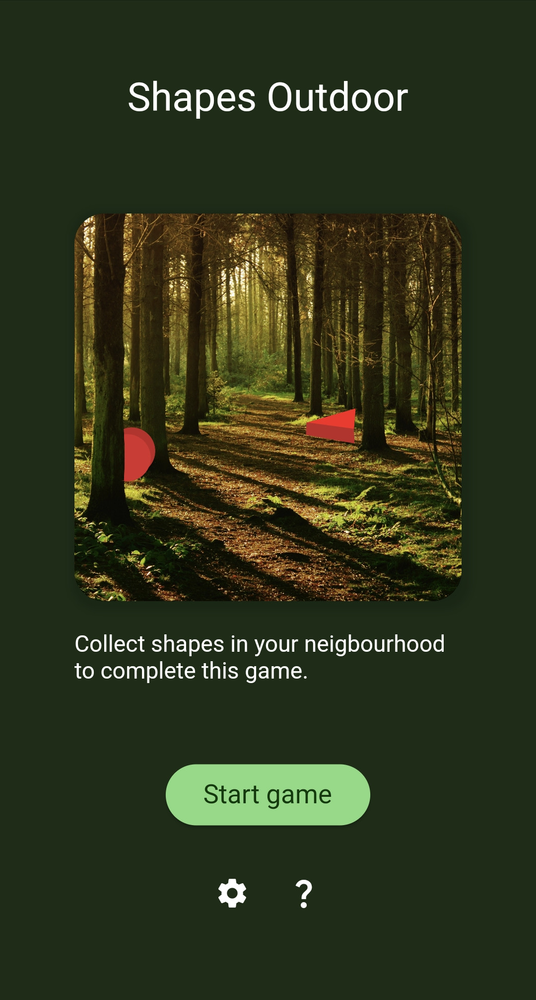
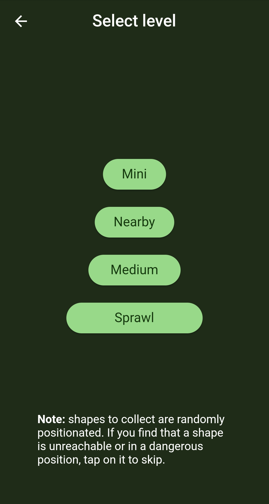
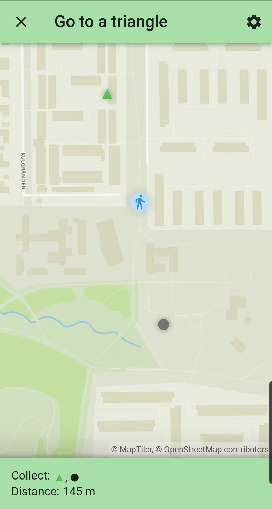

# Shapes Outdoor 2
A Flutter remake of shapes-outdoor.

## Game overview
When the game starts, geometric shapes will be placed at some direction and distance from your current location. How far and the count vary by the selected game level.

You get a task list of shapes to collect. For example 1) Square, 2) Square, 3) Triangle, 4) Circle. You can pick any shape on the map of the current shape to collect, but not those of other geometric shapes.

To collect a shape, walk there so that you are in close proximity to the location and the game will show a count down for a duration you have to stay there to collect it.

You can opt-in to background mode in which case you do not need to open the app to collect shapes, as long as you remember where to go.





## Build
### Create .env
* MAP_URL: raster tile layer url to use in light mode
* MAP_URL_DARK: raster tile layer url to use in dark mode

```
MAP_URL=...
MAP_URL_DARK=...
```

If it is not MapTiler, the map attribution has to be updated.

### Bulid Release
#### Android
1. Create android/key.properties and fill in keystore parameters
2. `flutter build appbundle` or `flutter bulid apk`